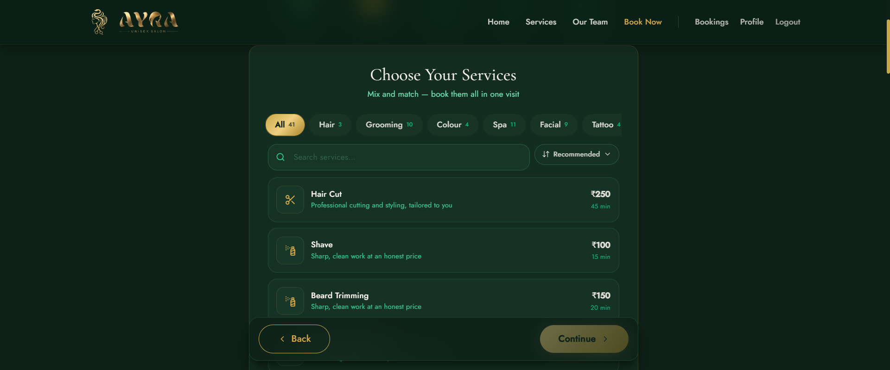
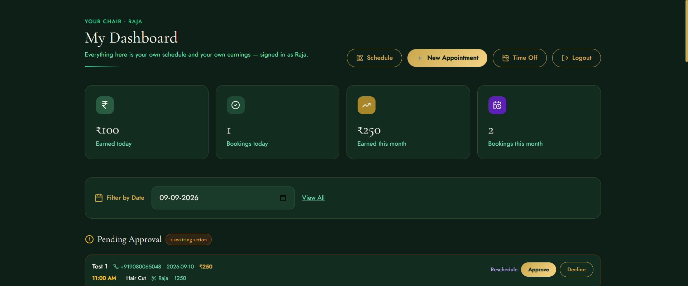
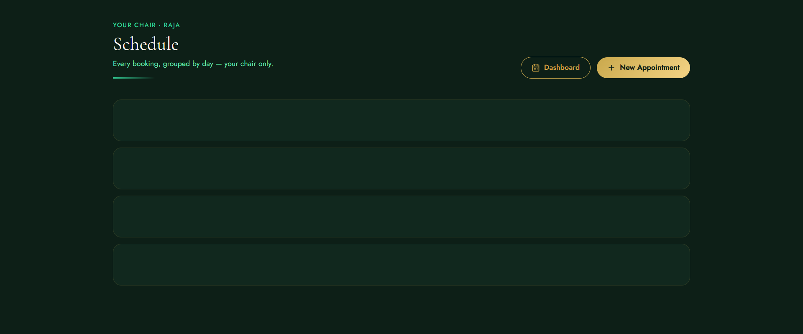
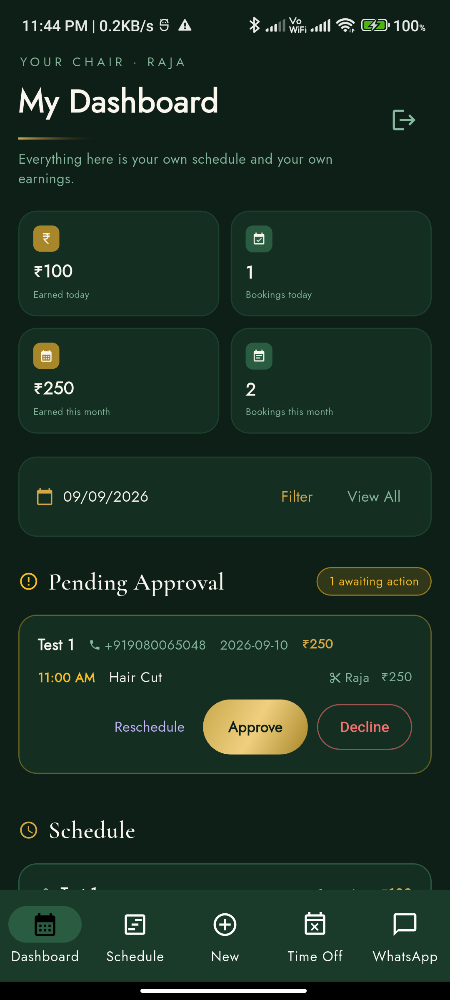
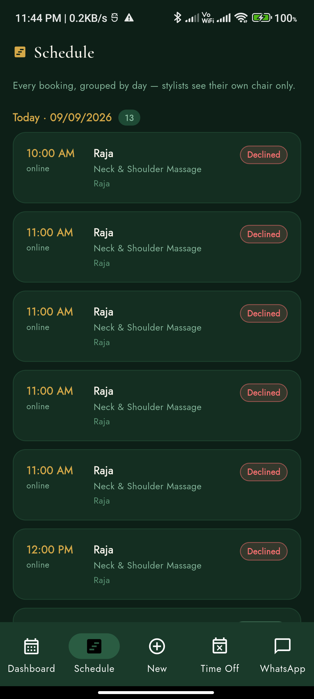
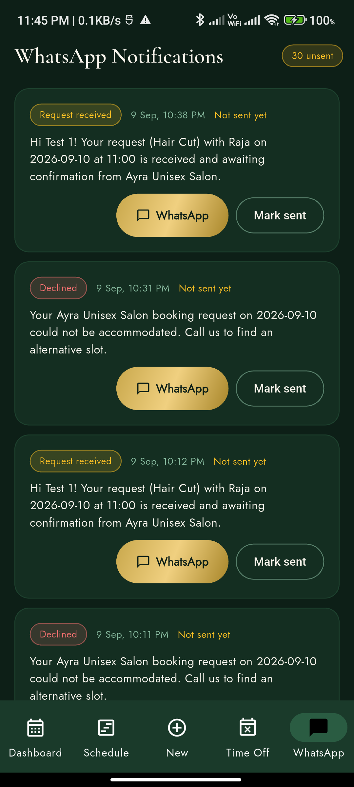

# Ayra Unisex Salon

A complete booking platform for a working salon — customer website, staff panel, and a native Android app for the stylists' chairs. Built for a real client, in production use on the salon floor.

**Stack:** FastAPI · MongoDB · React 18 (Vite + Tailwind) · Flutter

**Developer:** [Mohamed Shakeel](https://github.com/shakeelscribes) — designed and built the entire platform (backend, web, mobile). PRs reviewed by [Sri Thandapani](https://github.com/srithandapani).

## Screenshots

| Customer site | Booking flow |
| --- | --- |
|  |  |

| Staff panel — dashboard | Staff panel — schedule |
| --- | --- |
|  |  |

| Stylist app — dashboard | Stylist app — schedule | Stylist app — WhatsApp log |
| --- | --- | --- |
|  |  |  |

## The platform at a glance

The salon takes bookings through the website. Every new booking lands on the assigned stylist's phone as an insistent, impossible-to-miss alert. The stylist approves or declines it from the chair; schedule, walk-in entry, earnings, time-off and a WhatsApp message log live in the same app. The owner gets a full money dashboard — derived income, manual expenses, budget targets, per-stylist performance, CSV exports. Customers get email confirmations with `.ics` calendar invites that *move* on reschedule and *delete* on cancel. All time arithmetic runs in IST on every layer — server, web and app agree to the minute.

---

## Customer site (`frontend/`)

React 18 + Vite + Tailwind. JWT auth with a 401-interceptor axios client.

### Booking wizard
- **Multi-service cart** — customers add several services to one visit, each with its own stylist; the platform computes one back-to-back visit plan ("Hair Cut 10:00 → 10:45, Beard Trim 10:45 → 11:05").
- **Duration-aware slot math, mirrored client-side** — the wizard re-implements the server's rules so the grid never lies: whole-hour block sizing with a 30-minute grace buffer (`max(1, ceil((mins-30)/60))`), interval-overlap checks against the stylist's busy map, and closing-fit rejection.
- **Cascade viability** — a start time is only offered if *every* service in the cart fits back-to-back from that minute and each service's own stylist is free for its exact window.
- **IST correctness** — the clock is derived by shifting the epoch +5:30; a "day flip" after **20:45 IST** rolls the earliest bookable date to tomorrow, matching the salon's real closing routine.
- **10-minute cutoff** — today's slots disappear 10 minutes before start; the day's last slot (20:00) stays bookable until 20:15 so the salon can seat a late arrival in the final hour.
- **Audience rules** — men/women/unisex/kids filtering; services whose only specialists are off that day are hidden with a notice.
- **Recommended ordering** — services carry a 0–100 popularity score from the salon's real booking patterns; everyday services surface first.

### Accounts & history
- Register / login (JWT, bcrypt-backed), profile editing with Indian phone normalization (`+91`), gender preference that drives wizard defaults — clearable by sending null.
- **My Bookings** — full history with live status (pending / awaiting reschedule / confirmed / declined / cancelled); customers **accept or decline admin reschedule proposals** in place.
- **Notification feed** — every WhatsApp message the salon queued for them, with delivery status.
- **Tap-to-add calendar** — a `.ics` download endpoint serves the same invite UID as the emailed one, so adding it updates rather than duplicates.
- **Stylist profiles** — speciality, bio, years of experience, categories handled.

## Staff panel (`frontend-admin/`)

React 18 + Vite. Role model enforced at login: non-staff accounts are rejected; `AdminRoute` / `OwnerRoute` guards split the owner console from stylist-scoped views.

### Dashboard
- Date filter + stat cards (total / pending / reschedule / confirmed / cancelled / revenue).
- **Pending approval queue** and **awaiting-reschedule queue**, then the confirmed day schedule.
- **Approve / decline / cancel** with confirmation dialogs; every action writes an immutable audit entry into the booking's embedded history.
- **Propose reschedule** — sheet with a live slot grid (struck-through = booked, dimmed = won't fit before closing), optional reason, `exclude_booking_id` so a booking doesn't block its own move.
- Off-day banner: who marked themselves unavailable, with the roster joined to upcoming time-off ranges.

### New Appointment (walk-in entry)
- Full wizard mirroring the customer flow: customer → date → services → time, with the same cascade math and cutoff rules.
- **Known-customer lookup** — type a phone number, the form autofills name/email from the account (matched on the trailing 10 digits; staff accounts never surface).
- **Walk-in override** — seats a customer in a slot that already started today (waives only the cutoff; conflicts and past dates still apply).
- Book & confirm now, or save as pending for the normal approval flow.

### Schedule, WhatsApp, Time Off
- Day-grouped schedule per stylist.
- **WhatsApp log** — every message rendered server-side with a `wa.me` deep link; admin taps, sends from the salon's WhatsApp, marks it sent. Amber badge counts unsent.
- Time-off marking (stylists) and the all-staff upcoming roster.

### Economy (owner-only)
- **Overview** — derived income (per-slot service prices, attributed to each slot's own stylist), expenses, net, booking funnel with walk-in vs online counts, daily income/expense bars, breakdowns by category and stylist.
- **Expenses** — manual money-out entries across fixed categories (rent, products, salaries, utilities, marketing, maintenance, other).
- **Budgets** — monthly per-category targets with spent-vs-target bars (red when over, amber near target); setting 0 clears a goal.
- **By Stylist** — revenue, bookings, services performed, booked hours, top services per stylist; zero-revenue stylists still appear.
- **CSV exports** — bookings / income / expenses with a UTF-8 BOM so Excel opens them cleanly.

## Stylist app (`admin_app/`, Flutter)

Native Android app for the chairs. Portrait-locked, `en_IN` localisation (day-first date pickers), custom emerald/gold design system with `GlassCard`, `GoldButton`, pressable-scale feedback and staggered `Reveal` entrances that respect reduced-motion.

### The alert pipeline — "the phone must ring"
The backend sends **data-only FCM pushes**; the app owns all presentation:

- **Insistent alarm** — full-screen notification on a dedicated alarm channel (bypasses DND) with `FLAG_INSISTENT`: the OS loops the bundled chime natively until the notification is replaced or cancelled. No timers, no re-fire chain; works from a dead process.
- **Work-hours awareness** — insistent during 08:00–22:00 IST; during quiet hours the same notification posts on a silent channel (banner, no sound).
- **Day-boundary exact alarms** — an unacknowledged booking silences itself at 22:00 and rings again at 08:00 (auto-cancelling via `timeoutAfter` when quiet hours resume), until acknowledged or the backend's 24-hour TTL expires it.
- **The MIUI fix** — Android's `timeoutAfter` races the boundary re-post on MIUI 13 / Android 12, killing the alert mid-ring. Fixed with a 30-second grace margin so the silent replacement always lands first. Verified on a physical Redmi.
- **Stop conditions** — booking resolved push, queue opened, notification tapped. A 15-second pending-count poll covers FCM outages while the app is open. Everything fails open: an alert failure never breaks the app.

### Day-to-day operations
- **Dashboard** — pending / awaiting-reschedule / confirmed queues scoped to the stylist's own chair, earnings strip (today + month, from `/economy/me/summary`), next-appointment card, stylist load bars animated from real service durations.
- **Approve / decline / cancel / propose reschedule** with per-card spinners and a viability-aware slot sheet — same `exclude_booking_id`, grace, and cutoff rules as the web panel.
- **New Appointment** — the full walk-in wizard: debounced known-customer lookup (400 ms), own-chair enforcement for stylist logins, audience switching that prunes the cart, off-day filtering, "Total ≈ N min · reserves M hours", a live "Your visit" timeline, and the in-progress-slot walk-in override.
- **Time Off** — self-service range marking with a chain: it is *blocked* while active bookings exist in the range; the API returns the conflicts and the app renders them as cancel-able cards. Owners see the read-only roster.
- **Economy** (owner logins only — the tab hides for stylists): overview, expenses, budgets, by-stylist; CSV exports copy to clipboard with a paste hint.
- **WhatsApp** — last 30 queued messages, tap-to-send deep links, mark-sent, unsent badge.

## Backend (`backend/`)

FastAPI + MongoDB (Motor / Beanie ODM). Nine routers: auth, users, stylists, services, availability, bookings, notifications, economy, devices. Ten document models with purpose-built indexes.

### The scheduling engine (`routes/availability.py` + `routes/bookings.py`)
- Salon day grid **10:00–20:00 hourly, all week**, last start 20:00. Every constant mirrored client-side across all three frontends.
- **Bookings are blocks, not slots** — services run back-to-back with real start times: a 45-min haircut in a 10:00 visit starts 10:00, the next service 10:45. Each `BookingSlot` row carries its true interval `[start, start + duration)`.
- **Grace absorption** (`GRACE_MINS = 30`) — the first 30 minutes of overflow past an hour boundary is free: 140 min → 2 hours, 150 → 2, 151 → 3. Stylists are experienced; the buffer absorbs overrun.
- **Two-sided interval-overlap conflicts** — the customer is checked for the whole visit, each stylist per exact service window; touching intervals (10:00–10:45 vs 10:45–11:10) do *not* conflict.
- **Freshness guard in IST** — no past dates, 10-minute cutoff with the single 20:15 last-slot exception. Using UTC would mis-judge "today" during the 00:00–05:30 IST window.
- **Category & audience guards** — a stylist without the service's category is rejected (with a fallback when no specialist exists at all); men's and women's services can't be mixed in one visit; duplicates rejected; enquiry-only services (bridal) rejected.
- **Time-off guard** — bookings into a marked-off day are rejected defensively, even though the wizard already hides off stylists.
- **Delete-on-free model** — cancelling, declining or expiring a booking *deletes* its slot rows; that deletion *is* the freeing of time. Availability queries scan only live rows. Unique compound indexes — `(stylist, date, slot)` and `(customer, date, slot)` — stand as a same-start-minute safety net.
- **Reschedule protocol** — admin proposes a new date/slot (the whole block moves, same stylists and durations); the booking enters `awaiting_reschedule`; the customer accepts or declines from My Bookings. Proposals older than 24 h auto-decline.

### Booking lifecycle & audit
- Status machine: `pending → awaiting_reschedule → confirmed / declined / cancelled`, with an embedded immutable history — `{ts, actor: customer|admin|system, action, from_status, to_status, payload}` — on every transition.
- **TTL cron** — a lifespan task runs every 15 minutes and auto-declines pending bookings (and stale reschedule proposals) older than 24 hours, freeing slots, notifying the customer, and silencing the stylist's alarm.
- **Walk-ins** — `POST /bookings/admin/create` finds-or-creates the customer by phone (trailing-10-digit match; synthetic `walkin.*@ayrasaloon.local` email keeps the account claimable later). Ops separation: stylist staff can only enter walk-ins for their own chair.
- **`pending-count`** — a cheap poll target that powers the app's alert fallback.

### Role model & authorization
- Roles are **derived server-side, never trusted from the client**: owner (`is_admin`, no stylist link), stylist (`is_admin` + `stylist_id`), customer.
- `can_act_on_booking` — owners act on everything; stylists act only on bookings touching their chair (primary stylist *or* any slot row). Enforced on approve/decline/reschedule/cancel.
- Owner-only endpoints guard all salon-wide money; stylists get their own scoped slice (`/economy/me/summary`) computed from their token's `stylist_id`, never a client-sent id.

### Economy endpoints
- `/economy/summary` — derived income from confirmed bookings (per-slot price, attributed to each slot's stylist), expenses by category, booking funnel, walk-in vs online split, daily series for charts.
- Expenses CRUD with fixed categories; monthly budget targets (unique per month+category; 0 clears).
- `/economy/by-stylist` — revenue, distinct bookings, slots, booked hours, top services.
- `/economy/export` — bookings / income / expenses CSV with UTF-8 BOM.
- `/economy/me/summary` — the stylist's today/month revenue, booking counts, and next upcoming appointment.

### Notifications, push, email & calendar
- **WhatsApp** (`services/whatsapp.py`) — manual mode today: the backend renders the message and a `wa.me` deep link; a delivery-status ledger (`pending → manual_sent`, `auto_sent`/`failed` reserved) tracks each one. Swapping in the Cloud API later means changing one file.
- **Push** (`push.py`) — data-only FCM, high priority, multicast with **unregistered-token pruning**; firebase-admin initializes lazily so a missing service-account JSON degrades to polling instead of crashing.
- **Email** (`services/emailer.py`) — Resend primary, SMTP fallback via env, branded inline-styled HTML (Gmail/Outlook-safe). Booking routes never depend on email succeeding.
- **Calendar** (`services/ics.py`) — hand-rolled RFC 5545 builder: stable per-booking UID, `SEQUENCE` bumps make the customer's calendar *move* the event, `METHOD:CANCEL` deletes it. Text escaping, 75-octet line folding, IST→UTC conversion (exact — India has no DST), 1-hour `VALARM`.

### Seeding & migrations (`main.py`, `database.py`)
- **Canonical catalog** — 67 services across 7 categories transcribed from the salon's real price sheet (with `for_kids` variants and enquiry-only bridal), plus a 0–100 popularity map driving "Recommended" ordering.
- **Idempotent catalog sync** — every boot inserts missing entries, deletes stale ones (keyed on name + audience + kid_gender), and backfills fields introduced later (audience, `kid_gender`, `popularity`, `bookable`) via raw-collection counts — because Pydantic defaults mask a field's absence.
- **Stylist team seed** with per-boot category sync; **admin seed** whose password is never hardcoded (env override or a random secret printed once); **stylist staff accounts** (`raja@` / `ajay@`) linked to Stylist docs, created only when missing.
- **Pre-index maintenance** — backfills `user_id` on legacy slot rows, resolves pre-constraint duplicate bookings, drops renamed indexes — all *before* Beanie creates the unique indexes, or index creation itself would fail.

### Security posture
- JWT (HS256, 24 h) with **no hardcoded fallback secret** — if `SECRET_KEY` is unset the server generates an ephemeral random key and fails loudly: tokens stay unforgable, and the cost (everyone re-logs-in on restart) makes the misconfiguration visible instead of silent.
- bcrypt password hashing; slowapi rate limiting per IP (`/auth/*` 30/min, `POST /bookings/` 5/min, `/availability/` 60/min); CORS allow-list from env (`ALLOWED_ORIGINS`).
- Secrets (`.env`, Firebase service account) are gitignored; only public client config (`google-services.json`) is committed.
- Customer lookup for walk-in autofill is read-only and never surfaces staff accounts.

---

## Architecture

```
┌──────────────────┐     ┌──────────────────┐
│  Customer site   │     │   Staff panel    │
│  React (Vite)    │     │   React (Vite)   │
│  :5173           │     │  :5174           │
└────────┬─────────┘     └────────┬─────────┘
         │        REST / JWT      │
         └───────────┬────────────┘
                     ▼
          ┌─────────────────────┐        ┌──────────────────┐
          │   FastAPI backend   │──────▶ │  Firebase (FCM)  │
          │   MongoDB (Motor/   │        └────────┬─────────┘
          │   Beanie), bcrypt,  │                 │ data push
          │   slowapi limiter   │                 ▼
          └─────────┬───────────┘     ┌──────────────────────┐
                    │                 │  Flutter admin app   │
          ┌─────────▼───────────┐     │  full-screen alert + │
          │  Resend email +     │     │  looping chime +     │
          │  .ics calendar      │     │  exact alarm         │
          │  invites            │     └──────────────────────┘
          └─────────────────────┘
```

One set of scheduling rules — the day grid, the 30-minute grace, the 10-minute cutoff, the 20:15 last-slot exception, the 20:45 IST day-flip — is implemented three times, in Python, JavaScript and Dart, and kept in lockstep so the grids can never disagree with the server.

## Repo layout

```
├── backend/           FastAPI API server
│   ├── routes/        auth, users, stylists, services, availability,
│   │                  bookings, notifications, economy, devices
│   ├── services/      emailer (Resend + SMTP), ics, whatsapp, timeoff
│   ├── auth.py        JWT + bcrypt, role guards, booking-scoped authorization
│   ├── models.py      10 Beanie documents, compound unique indexes
│   ├── main.py        lifespan, TTL cron, canonical catalog + idempotent seeds
│   └── push.py        Firebase Cloud Messaging (lazy init, token pruning)
├── frontend/          Customer booking site (React + Vite + Tailwind)
├── frontend-admin/    Staff panel (React + Vite)
├── admin_app/         Stylist Android app (Flutter) — alert pipeline, wizard,
│                      economy, time-off, WhatsApp log, design system
├── PLAN.md            build process and decisions
├── RETREAT.md         build process and decisions
└── docs/screenshots/  README imagery
```

## Status

- ✅ In production use at the salon (customer site, staff panel, Flutter app on stylists' devices)
- 🚧 VPS deployment of the backend in progress
- 📋 `PLAN.md` and `RETREAT.md` document the build process and decisions

## Credits

- **[Mohamed Shakeel](https://github.com/shakeelscribes)** — lead developer. Built the entire infrastructure: FastAPI backend, customer site, staff panel, and the Flutter admin app.
- **[Sri Thandapani](https://github.com/srithandapani)** — contributor and PR reviewer.
